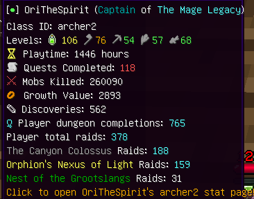
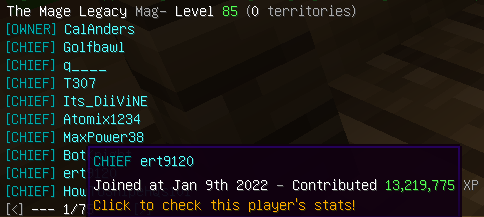

# WynnStats
## A stat tracker mod

## Goal

Allowing players to check one's stats without going into WynnData or other stat-checking sites.

This should save player's time as using bots like moto-bot or online sites can sometimes take a good amount of time during the search.

The goal of this mod is to minimize the search time.

## Usage

- /stat guild [Guild Name] - Displays general info about the guild and members.
- /stat player [Player Name] - Displays info about the player.

## Features

- Player name can be auto-completed with tab.
- Caches the data for up to 10 minutes for faster next-time query.
- Async querying data to prevent any lag when waiting for response

## Future Features

- Cache guild tag:guild name to allow one to search by guild tags.

## Image Showcases
Querying player data, hovering over their name

Querying guild data
